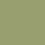
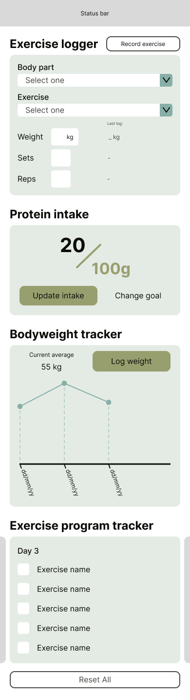

# LTRA3694-tracker
## Design approach:
### Concept + Rationale 
The concept of this website is to provide users, specifically individuals that were interested in their physical activity and health, a all-in-one way to view and track their progress, see imporvement, and adjust goals to meet their personal needs. This website included four main components (which could be viewed as "widgets") that users would be able to inteact with to allow the system produce an output, wether this output involved calculations, or storing data.

### Features
The features are all found stored within the four main widgets, their purposes and aims are listed below:
- **Exercise Logger -** This widget rememebers data the user previously inputted, and allows users to add new data in to compare and track their progress.
- **Protein intake -** This component adds together data user inputs and also allows users to change the overall goal. The app resets the inputted intake every midnight
- **Bodyweight tracker -** Bodyweight gets adveraged throughout a weeks worth of data, and also visualises and tracks bodyweight with a line graph
- **Exercise program tracker -** Simple checkbox that lets users see what they have and have not completed. Can be reset with a button

## Version control
This project uses github for tracking and managing changes made across multiple devices. Please see the github repositry here: https://github.com/LouvianTran/LTRA3694-tracker

### Design: Screen approach
For this website, I wanted to go with a mobile-first approach, as opposed to a desktop-first. This was beacuase this app was designed to be used within many different settings e.g. gym, at a scale, on the go, etc, and it would be more ebenficial to build the site catered to a on-the-go device.

### Breakpoints
When first deciding the breakpoint from mobile to desktop screens, I was going to use a 768px (a tablet screen size) as it was the screen size in between both and did not foce desktop layouts to be reserved for >1024, however, later on when React is installed, I end up sticking to one of their premade breakpoints. The breakpoint I chose to use was "md", which shared the same px (≥768px)

## Design system:
### Typography (font + sizing, account for different screen sizes)
For the choice of font, I decided to stick with the default MUI theme, the font was already accurate the the visual portray of the website I had originally had in mind. I chose to edit the sizing of the elements, however, as I felt that the given hierachy was more suited to longer websites that needed to utilise multiple different headers under headers, which this "widget function" system did not require. As such, I edited the text sizes I will be utilising below:

| Text hierachy | Mobile ( MUI "xs") | Desktop (MUI "md")| 
| ------------- | -------------      | -------------     |
|    Heading    | 1.5 rem            | 2 rem             |
|   Paragraph   | 1 rem              | 1.5 rem           |
|    Caption    | 0.5 rem            | 1 rem             |

### Colour palette
For my colour palette, I chose to go monotone sage palette. This palette was tested against a colour contrast accessibility checker (Clapperton, A., 2023), which determined that the color pairings I was aiming to use all passed AA regulations (>7:1 contrast ratio).

| Text type  | Color # | Color preview            |
| ---------- | ------- | ------------------------ |
| Text       | #0C0C08 |  |
| Background | #F8F8F5 |  |
| Primary    | #989F6F |  |
| Secondary  | #87AFA8 |  |
| Accent     | #E4EBE5 |  |

### High-fidelity
Before ccoding, I created a high fidelity image of how I wanted the website to come together, given the proposed design system. This was done in Figma.

Additioonal adjustments made from the previous mid-fidelity to high-fidelity includes: changing secondary buttons to give them a noticable difference to non-clickable/inactive buttons




## Initial website constructions (pre react.js / Material UI)

### Constructing HTML
Within the HTML, I started laying out the basic structures and seperating the different widgets with sections. Each element either had a class, id, or both Different inputs I pasted in included:

- Buttons (CTA, secondary, inactive)
``` html
<button id="reset" class="secondary-button">Reset all</button>
<button class="cta-button">Log weight</button>
```

- Checklists
```html
 <form class="day-checklist" id="day-four-checklist">
    <input type="checkbox" id="leg-press" value="leg-press">
    <label for="leg-press">"Leg Press"</label>
    
    <input type="checkbox" id="bss" value="bss">
    <label for="bss">"BSS"</label>

    <input type="checkbox" id="quad-extension" value="quad-extension">
    <label for="quad-extension">"Quad Extension"</label>
    
    <input type="checkbox" id="calf-raises" value="calf-raises">
    <label for="calf-raises">"Calf Raises"</label>
    
    <input type="checkbox" id="leg-raises" value="leg-raises">
    <label for="leg-raises">"Lef Raises"</label>
</form>
```

- Dropdown menu:
``` html
<label for="exercise-select">Exercise:</label>
<select name="exercise-select" id="exercise-select-dropdown">
    <option value="option-one">option</option>
    <option value="option-two">option</option>
    <option value="option-three">option</option>
    <option value="option-four">option</option>
    <option value="option-five">option</option>
    <option value="option-six">option</option>
    <option value="option-seven">option</option>
    <option value="option-eight">option</option>
    <option value="option-nine">option</option>
    <option value="option-ten">option</option>
    <option value="option-eleven">option</option>
</select>
```

### Constructing CSS
- Mention creating variables for e.g. breakpoints + colours, font sizing
- Responsive layout

Next, for creating a grid layout similar to what I had created as a mid-fidelity desktop screens, I utilised an online CSS grid generator (Leniolabs, 2024). From here, i made the grid look as close to the wireframe as possible:

Since i planned to have my mobile layout have the widgets stack on top of one another, this screen size did not need to use a grid. I then imported this code into style.css.

``` CSS
.container {  display: grid;
  grid-template-columns: 1.7fr 1.2fr;
  grid-template-rows: 1.5fr 0.5fr 2.1fr;
  gap: 2% 1.5%;
  grid-auto-flow: row;
  grid-template-areas:
    "exercise-logger protein-intake"
    "exercise-logger bodyweight-tracker"
    "exercise-program-checklist bodyweight-tracker";
  width: 100%;
  height: 100%;
}

.exercise-logger { grid-area: exercise-logger; }

.exercise-program-checklist { grid-area: exercise-program-checklist; }

.protein-intake { grid-area: protein-intake; }

.bodyweight-tracker { grid-area: bodyweight-tracker; }
```

## Installing MUI + React
To make the coding experince more simple design elements more fluid to one another, I employed the help of installing React.js, as well as MUI to the code. I then moved on to customising the default values and themens to fit my Figma prototype. This was done in the root ```src/component/styleSheet.js``` file. From here. I moved onto making a ```styleSheet.js```, where i created different styles to suit my proposed design system.

## Using React:
Using the react library, I restarted the layout of creating widgets in seperate js files, then planned on importing all of these seperate js files into the main ```App.js``` file.
___
## Difficulties during coding: 
### npm installation
While working on this project, I had run into an issue starting my server up through npm, nameably, the terminal continually failed to recognise npm as a command in the terminal, and this, I would not be able to host a server. 


This halted my ability to continue with the project constantly, as I would have to fix when I restarted my computer, and solutions online proved to not be applicable to my case. 
A solution that was recommended to me by individuals familiar with using VSCode was to run the following commands into the ```Git Bash``` terminal:

1. ``` export NVM_DIR="$([ -z "${XDG_CONFIG_HOME-}" ] && printf %s "${HOME}/.nvm" || printf %s "${XDG_CONFIG_HOME}/nvm")" ```
2. ```[ -s "$NVM_DIR/nvm.sh" ] && \. "$NVM_DIR/nvm.sh"```
3. ```npm install```

### React.js learning curve
The biggest struggle of this project was adjusting to the syntax and layout that the React.js framework provided. Although React.js helps to simplify and condense steps of front-end design, I felt that I was unable to understand and efficiently utilise this new system given the timeframe I was able to dedicate to this project. Due to this, my progress was slower than constructing the website than without.
___

## Use of AI
For this website project, AI (namely, ChatGPT) was used used to help fix lines of react.js code. 
Some prompts and answers that were provided to the AI included:

**Q:** why is npm command not found in bash terminal in vs code and how do i fix it

**A:** If you are encountering the "npm command not found" error in your bash terminal in VS Code, it typically means that the Node.js and npm (Node Package Manager) are not installed correctly or their installation paths are not set up properly. Here are the steps to troubleshoot and fix this issue:

- Check Node.js Installation:
- Install Node.js and npm:
- Update Environment Variables (PATH):
- Restart VS Code:
- Check Integrated Terminal Shell:
- Reinstall VS Code:

**Q:** "export const wideBox = {
    padding: 3, 
    width: "55%",
    backgroundColor: '#E4EBE5', 
    borderRadius: 2 }

how do i let the width have a mobile breakpoint to 85% using react.js"

**A:** To allow the width of a box to be responsive, changing to 85% on mobile devices and 55% on larger screens, you can utilize Material-UI's responsive styling capabilities. You can define a responsive style object and use it within the sx prop or styled function.

Here’s how you can achieve this using the sx prop:

___

## References
Clapperton, A.,Tarpey, W.(June 8, 2023.). Colour Contrast Checker [Website]. https://colourcontrast.cc/ 

Leniolabs. (2024). LayoutIt! [Website]. https://layoutit.com/

MUI Core Team. (2014). Material-UI (Version 5.0) [Computer software]. https://mui.com/

Meta Platforms, Inc. (2013). React (Version 17.0.2) [Computer software]. https://react.dev/ 

